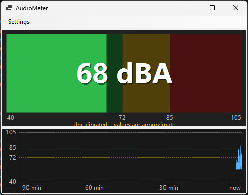
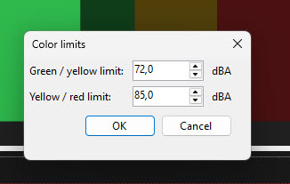
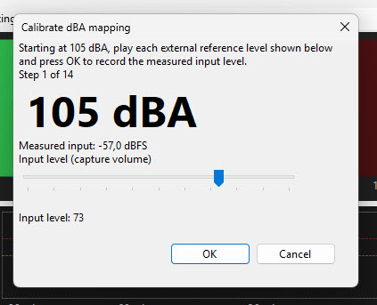

# AudioMeter

AudioMeter is a small, always-on-top Windows sound-level monitor for churches,
events, and other venues. It listens to a selected audio input, converts its
measured level to an estimated dBA value using a calibration table, and displays
the current level in green, yellow, or red. A 90-minute chart helps you see how
the level changes over time.

Use it as a practical visual aid for spotting potentially loud sound levels. It
is not a substitute for a certified sound-level meter or professional acoustic
measurement.

## Features

- Live level display updated every 0.5 seconds.
- Green, yellow, and red level zones with configurable thresholds (defaults:
  green through 70 dBA, yellow through 85 dBA, red above 85 dBA).
- A scrolling chart of recent readings covering up to 90 minutes.
- Selection of active Windows audio capture devices.
- Guided calibration from 40 to 105 dBA in 5 dBA steps.
- Saved calibration associated with its audio input and input gain; the app
  indicates when a device or gain change makes recalibration necessary.
- Automatic saving of display settings and selected input.

## Screenshots

### Main meter



### Color limits



### Calibration



## Requirements

- Windows 10 or later to run the app.
- An active Windows audio capture input, such as a microphone or audio interface.
- For meaningful dBA estimates, a stable reference sound source and a separate,
  trusted sound-level reference for calibration.

## Build and run

Building the app from source requires the .NET 10 SDK. You do not need the SDK
just to run the app on Windows 10 or later.

From the repository root, run these commands in PowerShell:

```powershell
dotnet restore AudioMeter.sln
dotnet build AudioMeter.sln
dotnet run --project src\AudioMeter.App\AudioMeter.App.csproj
```

Run the core tests with:

```powershell
dotnet test tests\AudioMeter.Core.Tests\AudioMeter.Core.Tests.csproj
```

## Using the meter

1. Start AudioMeter. It opens as an always-on-top window and uses the selected
   input, or the Windows default capture input if none has been selected.
2. Open **Settings → Audio input** to choose an active capture device.
3. Open **Settings → Calibrate…** and follow the prompts using known reference
   levels. Calibration samples are taken at 40, 45, …, 105 dBA.
4. Use **Settings → Color limits…** to adjust the green/yellow and yellow/red
   thresholds. Limits must be between 40 and 105 dBA, with the red threshold
   higher than the green threshold.
5. Monitor the current reading in the meter and use the chart to review recent
   changes. If input is unavailable or stops producing data, the app displays a
   status message and retries capture.

Until calibration is completed, the app displays an **Uncalibrated** warning and
the dBA values are approximate. AudioMeter measures average absolute input
amplitude in half-second windows and maps that level through the calibration
table. The resulting estimate depends on the microphone or input device,
placement, room, and input gain. Keep those conditions consistent with the
calibration setup. Changing the input device or its gain invalidates the saved
calibration until you recalibrate.

## Settings and data

AudioMeter saves settings, calibration points, selected input, and window
position in:

```text
%APPDATA%\AudioMeter\settings.json
```

## Continuous integration and releases

- **Pull requests to `main`** run the `PR Build` workflow, which builds the
  solution in Release configuration and runs the unit tests. Test results are
  uploaded as an artifact.
- **Every commit on `main`** runs the `Release` workflow: it builds, runs the
  tests, publishes the app, zips it as `AudioMeter-v1.0.<run number>-win.zip`,
  and publishes a GitHub release with the same version tag. The ZIP is also
  kept as a workflow run artifact.
- To get the app, download the ZIP from the latest
  [release](../../releases), extract it, and run `AudioMeter.App.exe` (the
  .NET 10 Desktop Runtime is required).
## Continuous integration and releases

- **Pull requests to `main`** run the `PR Build` workflow, which builds the
  solution in Release configuration and runs the unit tests. Test results are
  uploaded as an artifact.
- **Every commit on `main`** runs the `Release` workflow: it builds, runs the
  tests, publishes the app, zips it as `AudioMeter-v1.0.<run number>-win.zip`,
  and publishes a GitHub release with the same version tag. The ZIP is also
  kept as a workflow run artifact.
- To get the app, download the ZIP from the latest
  [release](../../releases), extract it, and run `AudioMeter.App.exe` (the
  .NET 10 Desktop Runtime is required).
## Dependency updates

[Renovate](https://docs.renovatebot.com/) keeps NuGet packages and GitHub
Actions up to date. It is configured in `.github/renovate.json` and requires the
Renovate GitHub App to be installed on the repository (one-time, by the owner).

- Updates are only proposed once a week, on Monday before 06:00 (Europe/Berlin).
- Renovate opens pull requests automatically; they run the `PR Build` workflow
  and are never merged automatically.
- Minor and patch updates are grouped into one pull request, major updates get
  their own labeled pull request, and at most 5 pull requests are open at once.
- To change the schedule, edit `schedule` and `timezone` in
  `.github/renovate.json`. To pause updates, set `"enabled": false` there or
  uninstall the app.

## Project layout

- `src\AudioMeter.App` — Windows Forms UI, audio capture, device selection, and
  calibration dialogs.
- `src\AudioMeter.Core` — level conversion, calibration, history, and settings
  logic.
- `tests\AudioMeter.Core.Tests` — core unit tests.
